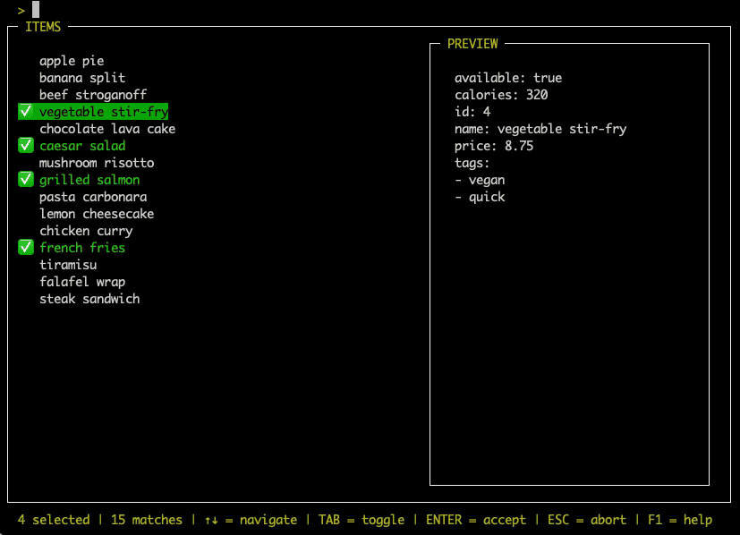
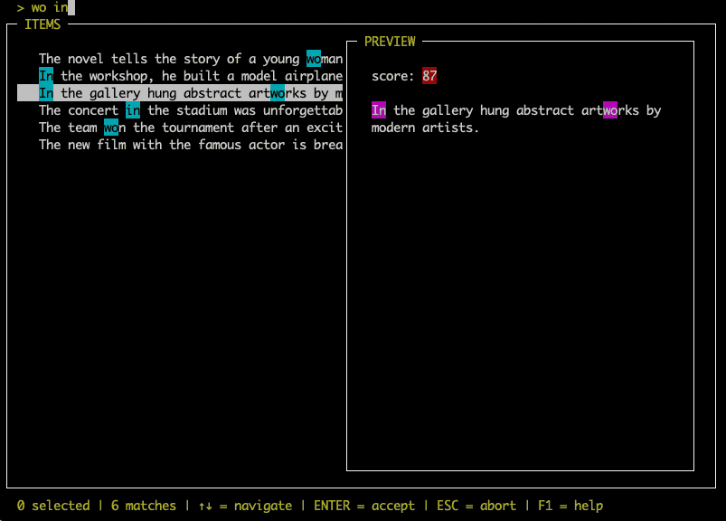

Advanced Usage
==============

Display Function
----------------

.. code-block:: python

    from typing import Any
    from curses_fzf import FuzzyFinder

    def display_name_property(item: Any) -> str:
        return item.name

    fzf = FuzzyFinder(display=display_name_property)
    result = fzf.find(data)

Since :class:`~curses_fzf.FuzzyFinder` allows you to work with lists of any type
of items, you may want to define a custom behavior of how it displays your items.
In the above example we have a list of objects, using their :py:obj:`name`
property to represent each item in :attr:`~curses_fzf.FuzzyFinder.filtered` list.

The :meth:`~curses_fzf.FuzzyFinder.display` function must return a single line
of text.
A :class:`~curses_fzf.CursesFzfAssertion` exception will be raised, if the
function returns multi-line text.
If you want to present more complex information, have a look at the
:meth:`~curses_fzf.FuzzyFinder.preview` function.

The default behavior is to stringify the item provided:

.. code-block:: python

    FuzzyFinder(display=lambda item: str(item))

Related examples:

- `dict_items_with_simple_preview_and_preselect.py`_

Preselect Function
------------------

.. code-block:: python

    from typing import Any
    from curses_fzf import FuzzyFinder, ScoringResult

    def preselect_items(item: Any, scoring_result: ScoringResult) -> bool:
        return item.get("calories", 999) < 400

    fzf = FuzzyFinder(multi=True, preselect=preselect_items)
    result = fzf.find(data)

If you use :class:`~curses_fzf.FuzzyFinder` in :attr:`~curses_fzf.FuzzyFinder.multi`
selection mode, you can pre-select some items using the
:meth:`~curses_fzf.FuzzyFinder.preselect` function.
This function is expected to return ``True`` if the item should be selected.

The default implementation always returns ``False``.

Related examples:

- `dict_items_with_simple_preview_and_preselect.py`_

Preview Function
----------------

.. code-block:: python

    import curses
    from typing import Any
    from curses_fzf import FuzzyFinder, ScoringResult, Color, ColorTheme

    def my_preview(preview_window: curses.window, color_theme: ColorTheme, item: Any, result: ScoringResult) -> str:
        preview_window.addstr(1, 1, item.description, curses.color_pair(Color.RED))
        return ""

    fzf = FuzzyFinder(preview=my_preview, preview_window_percentage=50)
    result = fzf.find(data)

The :meth:`~curses_fzf.FuzzyFinder.preview` function (default ``None``), if set,
will show a preview window on the right side of the
:class:`~curses_fzf.FuzzyFinder` main window.
You can use this window to present additional information about the item.

There are two possible ways to use this function:

Either you ignore the provided :py:obj:`preview_window` and simply return a
string, that can also be a multi-line string.
The :class:`~curses_fzf.FuzzyFinder` will take care of the text not leaking out
of the window boundaries.
For example you can :meth:`yaml.dump` :py:obj:`dict` items.

Or you return an empty string and use :py:obj:`preview_window` to modify the
:py:obj:`curses.window` manually.
If you do so, you should ensure to handle window boundaries correctly to avoid
crashes, e.g. on terminal resizing.
See :class:`~curses_fzf.ColorTheme` for information on coloring, the selected
:attr:`~curses_fzf.FuzzyFinder.color_theme` is also provided to the
:meth:`~curses_fzf.FuzzyFinder.preview` function for easy access.

Not only the :py:obj:`item` from :attr:`~curses_fzf.FuzzyFinder.filtered` list
is provided, but also the :class:`~curses_fzf.ScoringResult`.
This allows to display scoring related information.

You can use :attr:`~curses_fzf.FuzzyFinder.preview_window_percentage` parameter
of :class:`~curses_fzf.FuzzyFinder` to define the width of the preview window.
The default value is ``40`` percent of the terminal window.
Don't worry that the preview window might hide portions of your items,
you can toggle the preview window any time using :kbd:`Ctrl+P`.

Related examples:

- `dict_items_with_simple_preview_and_preselect.py`_
- `curses_preview_with_score_displayed.py`_

Scoring Function
----------------

.. code-block:: python

    from typing import Any
    from curses_fzf import FuzzyFinder, ScoringResult

    def my_scoring(query: str, candidate: str) -> ScoringResult:
        sr = ScoringResult(query, candidate)
        if sr.check_query_empty():
            return sr
        # ... scoring logic
        sr.add_match(match_index, matched_word, match_score)
        # ...
        return sr

    fzf = FuzzyFinder(score=my_scoring)
    result = fzf.find(data)

:class:`~curses_fzf.FuzzyFinder` comes with built-in scoring functions
(default :meth:`~curses_fzf.scoring_fzf`).
Scoring determines if an item is considered to match the
:attr:`~curses_fzf.FuzzyFinder.query` the user entered.
The higher the score the higher the item gets sorted among the matches in the
:attr:`~curses_fzf.FuzzyFinder.filtered` list.
If the score is ``0`` the item is considered to not be a match,
it will not be displayed in the list at all.

A scoring function retrieves the :attr:`~curses_fzf.ScoringResult.query` as its
first argument and the :attr:`~curses_fzf.ScoringResult.candidate` to match as
the second.
The :attr:`~curses_fzf.ScoringResult.candidate` is the
:meth:`~curses_fzf.FuzzyFinder.display` string of the item in question.

The function is supposed to return a :class:`~curses_fzf.ScoringResult`.

Related examples:

- `custom_scoring_and_color_theme.py`_
- `curses_preview_with_score_displayed.py`_

ColorTheme Customization
------------------------

.. code-block:: python

    from curses_fzf import FuzzyFinder, ColorTheme, Color

    fzf = FuzzyFinder(color_theme=ColorTheme(text=Color.CYAN))
    result = fzf.find(data)

:class:`~curses_fzf.ColorTheme` can be used to customize text colors,
e.g. to increase readability.
Use the indexes defined via :class:`~curses_fzf.Color` enum.
If you want to register your own :py:obj:`curses.color_pairs`,
the indexes ``1`` to ``29`` are safe to use.

Related examples:

- `custom_scoring_and_color_theme.py`_
- `curses_preview_with_score_displayed.py`_

Keymap And More
---------------

.. code-block:: python

    import curses
    from curses_fzf import FuzzyFinder

    fzf = FuzzyFinder()
    fzf.keymap[curses.KEY_F2] = lambda: fzf.kb_move_items_cursor_relative(2)
    result = fzf.find(data)

:class:`~curses_fzf.FuzzyFinder` is designed to be highly customizable.

For example you can define your own keybindings by modifying the
:attr:`~curses_fzf.FuzzyFinder.keymap` dictionary.
The keys are the key codes as returned by :py:obj:`curses.getch()`,
the values are functions that will be called when the corresponding key is
pressed.

Related examples:

- `custom_keybindings_and_external_functions.py`_

.. _custom_keybindings_and_external_functions.py: https://github.com/Heiko-san/curses_fzf/blob/main/examples/custom_keybindings_and_external_functions.py
.. _custom_scoring_and_color_theme.py: https://github.com/Heiko-san/curses_fzf/blob/main/examples/custom_scoring_and_color_theme.py
.. _curses_preview_with_score_displayed.py: https://github.com/Heiko-san/curses_fzf/blob/main/examples/curses_preview_with_score_displayed.py
.. _dict_items_with_simple_preview_and_preselect.py: https://github.com/Heiko-san/curses_fzf/blob/main/examples/dict_items_with_simple_preview_and_preselect.py
