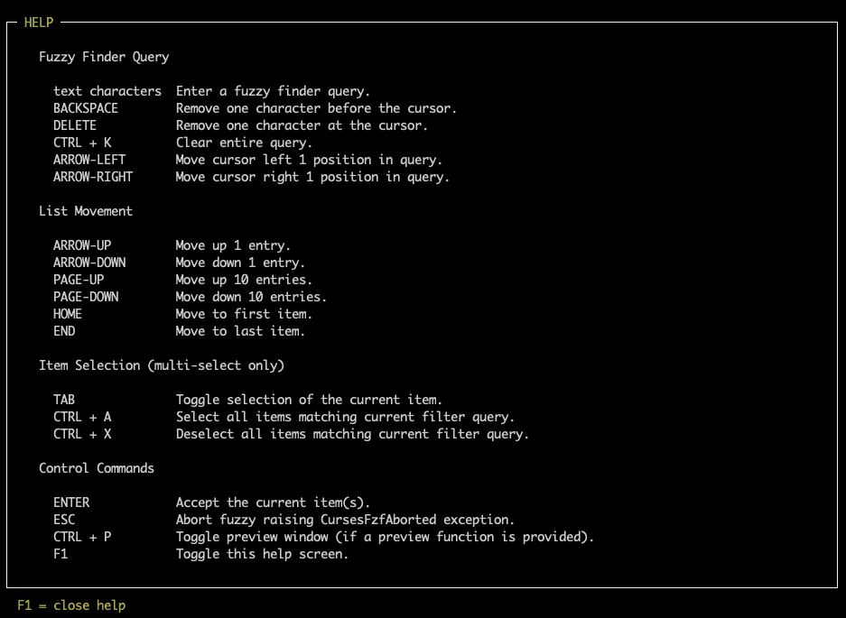
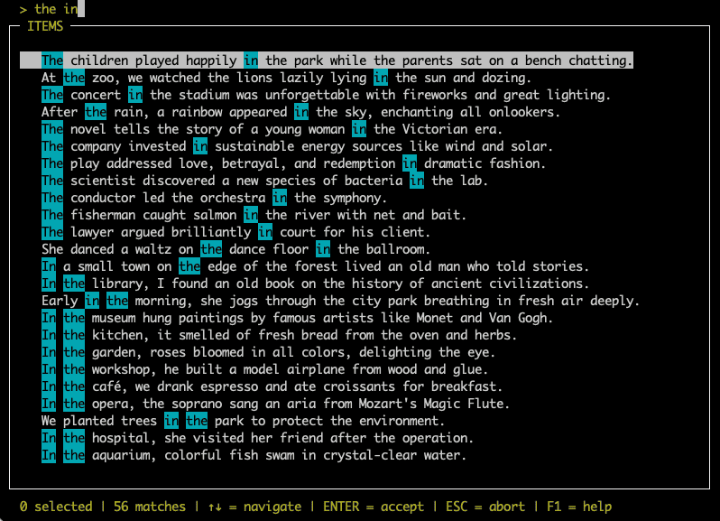

Basic Usage
===========

Minimal Example
---------------

.. code-block:: python

    from curses_fzf import FuzzyFinder, CursesFzfAborted

    data = ["apple", "banana", "grape", "orange", "watermelon"]
    fzf = FuzzyFinder()
    try:
        result = fzf.find(data)
    except CursesFzfAborted:
        print("Fuzzy finder aborted by user.")
    else:
        print(result[0])

In this minimal example, you can select a single item from a list of strings
using :class:`~curses_fzf.FuzzyFinder`.
Accept an entry using the :kbd:`ENTER` key or cancel the selection using the
:kbd:`ESC` key or :kbd:`Ctrl+C`.
Use :kbd:`F1` to toggle the help screen, which shows all available key bindings.
Since in single selection mode it is not possible to select no item, there is
either exactly one item in the resulting list or the selection process was
aborted by the user, which raises a :class:`~curses_fzf.CursesFzfAborted`
exception.

Related examples:

- `minimal_example.py`_

Multi Selection
---------------

.. code-block:: python

    from curses_fzf import FuzzyFinder, CursesFzfAborted

    data = ["apple", "banana", "grape", "orange", "watermelon"]
    fzf = FuzzyFinder(multi=True)
    try:
        result = fzf.find(data)
    except CursesFzfAborted:
        print("Fuzzy finder aborted by user.")
    else:
        for item in result:
            print(item)

In :attr:`~curses_fzf.FuzzyFinder.multi` selection mode, you can select an
arbitrary number (including zero) of items from the list using the
:kbd:`TAB` key. The final selection is again accepted using the
:kbd:`ENTER` key.

Related examples:

- `dict_items_with_simple_preview_and_preselect.py`_
- `min_max_items.py`_
- `custom_keybindings_and_external_functions.py`_

Query Pre-Seeding
-----------------

.. code-block:: python

    fzf = FuzzyFinder(query="the in")
    result = fzf.find(data)
    result2 = fzf.find(data, query="other search")

By default :class:`~curses_fzf.FuzzyFinder` will start with an empty
:attr:`~curses_fzf.FuzzyFinder.query`.
The unfiltered list will then be presented in its original order.

If the user enters a filter :attr:`~curses_fzf.FuzzyFinder.query` the
:attr:`~curses_fzf.FuzzyFinder.filtered` list is reduced to the matching items,
sorted by match :attr:`~curses_fzf.ScoringResult.score` (see
:meth:`~curses_fzf.FuzzyFinder.score` function).

The :attr:`~curses_fzf.FuzzyFinder.query` can also be pre-seeded with a given
string.
The user is still able to fully modify the :attr:`~curses_fzf.FuzzyFinder.query`,
including completely clearing it (:kbd:`Ctrl+K`).
The parameter :attr:`~curses_fzf.FuzzyFinder.query` can be given to
:class:`~curses_fzf.FuzzyFinder` constructor or the object's
:meth:`~curses_fzf.FuzzyFinder.find` method.

Related examples:

- `reusing_fuzzyfinder_and_autoreturn.py`_
- `min_max_items.py`_
- `custom_keybindings_and_external_functions.py`_

Title - Prompting the user
--------------------------

.. code-block:: python

    fzf = FuzzyFinder(title="Select an item!")
    result = fzf.find(data)
    result2 = fzf.find(data, title="other title")

Instead of ``"ITEMS"``, you can provide a custom title for the
:class:`~curses_fzf.FuzzyFinder` main window.
The parameter :attr:`~curses_fzf.FuzzyFinder.title` can be given to
:class:`~curses_fzf.FuzzyFinder` constructor or the object's
:meth:`~curses_fzf.FuzzyFinder.find` method.

Related examples:

- `min_max_items.py`_
- `reusing_fuzzyfinder_and_autoreturn.py`_

Autoreturn
----------

.. code-block:: python

    result = FuzzyFinder(multi=True, query="foo", autoreturn=3).find(data)

If the list of items provided contains exactly the number of entries defined
by :attr:`~curses_fzf.FuzzyFinder.autoreturn`, :class:`~curses_fzf.FuzzyFinder`
will return those entries without user interaction.

This is most useful in combination with a pre-seed
:attr:`~curses_fzf.FuzzyFinder.query`, in which case the number of matches
is checked against the :attr:`~curses_fzf.FuzzyFinder.autoreturn` value.

The default ``0`` means "don't autoreturn".
If :attr:`~curses_fzf.FuzzyFinder.multi` is ``True`` the number given as
:attr:`~curses_fzf.FuzzyFinder.autoreturn`'s value is checked against the
:attr:`~curses_fzf.FuzzyFinder.filtered` list of results.
If :attr:`~curses_fzf.FuzzyFinder.multi` is ``False`` the number given as
:attr:`~curses_fzf.FuzzyFinder.autoreturn`'s value is not relevant, if a single
match remains, it will be returned.

Related examples:

- `min_max_items.py`_
- `reusing_fuzzyfinder_and_autoreturn.py`_

Min/Max Items
-------------

.. code-block:: python

    result = FuzzyFinder(multi=True, min_items=2, max_items=3).find(data)

If :attr:`~curses_fzf.FuzzyFinder.multi` is ``True``, you can require the user
to select at least a certain number of items using
:attr:`~curses_fzf.FuzzyFinder.min_items` and at most a certain number of items
using :attr:`~curses_fzf.FuzzyFinder.max_items`.
If the user tries to accept a selection that does not meet these requirements,
accept the selection with :kbd:`ENTER` will not be allowed.

Related examples:

- `min_max_items.py`_

Page Size
---------

.. code-block:: python

    result = FuzzyFinder(page_size=5).find(data)

The :attr:`~curses_fzf.FuzzyFinder.page_size` parameter (default ``10``) defines
the number of entries that are skipped by the keys :kbd:`PAGE_UP`
and :kbd:`PAGE_DOWN`.
Modifying this parameter can be useful if you have a very long list of items and
want to jump through it faster.

Related examples:

- `dict_items_with_simple_preview_and_preselect.py`_

.. _dict_items_with_simple_preview_and_preselect.py: https://github.com/Heiko-san/curses_fzf/blob/main/examples/dict_items_with_simple_preview_and_preselect.py
.. _reusing_fuzzyfinder_and_autoreturn.py: https://github.com/Heiko-san/curses_fzf/blob/main/examples/reusing_fuzzyfinder_and_autoreturn.py
.. _custom_keybindings_and_external_functions.py: https://github.com/Heiko-san/curses_fzf/blob/main/examples/custom_keybindings_and_external_functions.py
.. _minimal_example.py: https://github.com/Heiko-san/curses_fzf/blob/main/examples/minimal_example.py
.. _min_max_items.py: https://github.com/Heiko-san/curses_fzf/blob/main/examples/min_max_items.py
